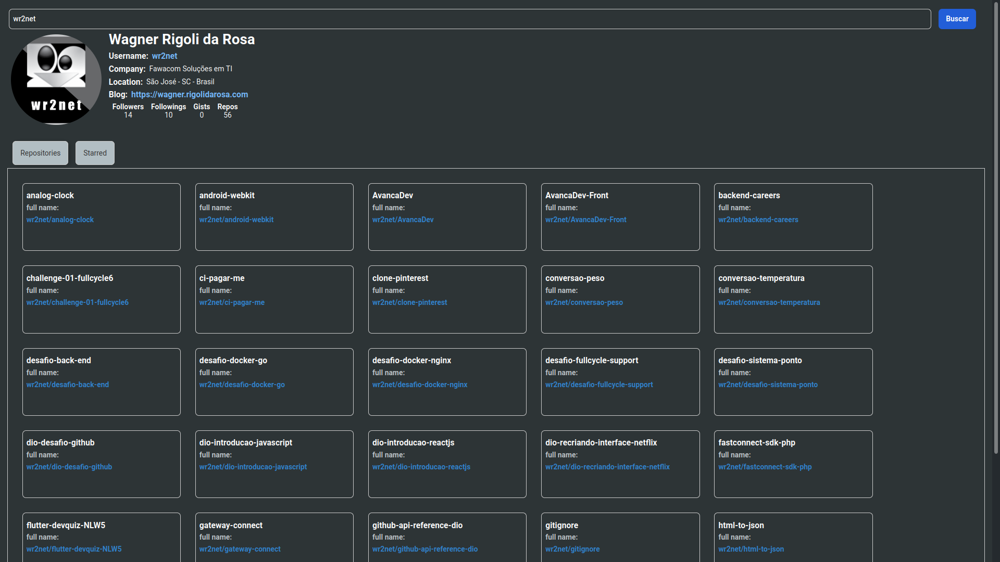

# Github Interface API
Este repositório foi criado para mostrar como podemos criar uma aplicação frontend com componentes reutilizáveis.

### Preview

## Como iniciar o Servidor:

1. Clone do repositório

`$ git clone git@github.com:wr2net/github-api-reference-dio.git`

2. Instalando dependências

`$ yarn install`

3. Suindo servidor

`$ yarn start`

